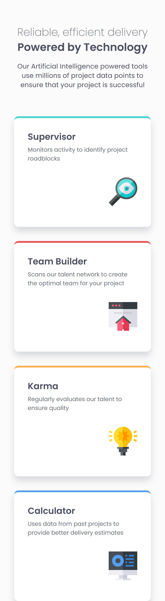

# Frontend Mentor - Four card feature section solution

This is a solution to the [Four card feature section challenge on Frontend Mentor](https://www.frontendmentor.io/challenges/four-card-feature-section-weK1eFYK). Frontend Mentor challenges help you improve your coding skills by building realistic projects. 

## Table of contents

- [Overview](#overview)
  - [The challenge](#the-challenge)
  - [Screenshot](#screenshot)
  - [Links](#links)
- [My process](#my-process)
  - [Built with](#built-with)
  - [What I learned](#what-i-learned)
  - [Continued development](#continued-development)
  - [Useful resources](#useful-resources)
  - [AI Collaboration](#ai-collaboration)
- [Author](#author)
- [Acknowledgments](#acknowledgments)

## Overview

### The challenge

Users should be able to:

- View the optimal layout for the site depending on their device's screen size

### Screenshot

### Links

- Solution URL: [Solution URL](https://github.com/Faith-Rose1/Four-card-feature-section)
- Live Site URL: [Live Site URL](https://faith-rose1.github.io/Four-card-feature-section/)

## My process

### Built with

- Semantic HTML5 markup
- CSS custom properties
- Flexbox
- Mobile-first workflow

### What I learned

- I got a good grasp of the flexbox layouts.

### Continued development

### Useful resources

- [fonts](https://gwfh.mranftl.com/fonts/montserrat?subsets=latin) - i downloaded the font needed for the challenge from here.

### AI Collaboration

- Asked gemini to calculate the clamp() values for me.

## Author

- Frontend Mentor - [@Faith-Rose1](https://www.frontendmentor.io/profile/Faith-Rose1)

## Acknowledgments
